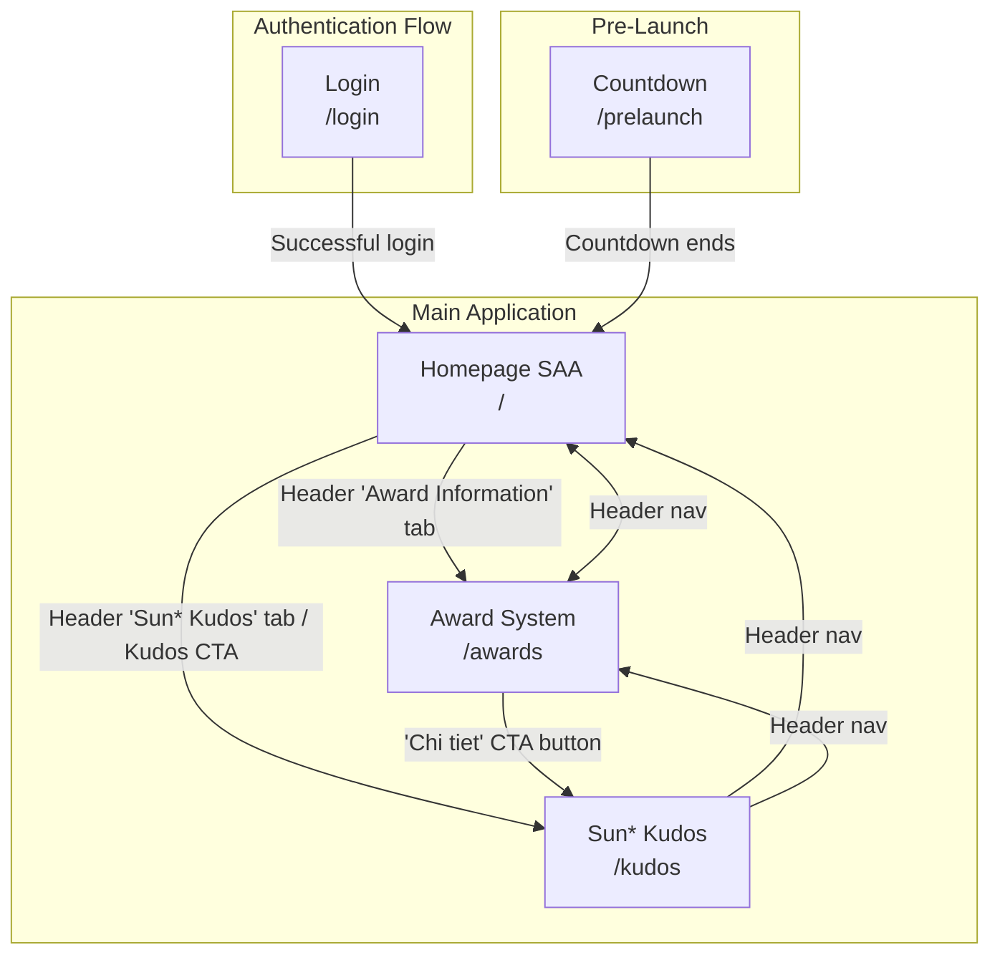

# Screen Flow Overview

## Project Info
- **Project Name**: SAA 2025 (Sun* Annual Awards 2025)
- **Figma File Key**: 9ypp4enmFmdK3YAFJLIu6C
- **Figma URL**: https://www.figma.com/design/9ypp4enmFmdK3YAFJLIu6C
- **Created**: 2026-03-19
- **Last Updated**: 2026-03-21

---

## Discovery Progress

| Metric | Count |
|--------|-------|
| Total Screens | 5 |
| Discovered | 5 |
| Remaining | 0 |
| Completion | 100% |

---

## Screens

| # | Screen Name | Frame ID | Figma Link | Status | Detail File | Predicted URL | Navigates To |
|---|-------------|----------|------------|--------|-------------|---------------|--------------|
| 1 | Login | 662:14387 | [Figma](https://www.figma.com/design/9ypp4enmFmdK3YAFJLIu6C?node-id=662:14387) | discovered | specs/662:14387-Login/spec.md | `/login` | Homepage SAA |
| 2 | Homepage SAA | 2167:9026 | [Figma](https://www.figma.com/design/9ypp4enmFmdK3YAFJLIu6C?node-id=2167:9026) | discovered | specs/9ypp4enmFmdK3YAFJLIu6C/2167:9026-Homepage-SAA/plan.md | `/` | Award System, Sun* Kudos |
| 3 | Award System (He thong giai) | 313:8436 | [Figma](https://www.figma.com/design/9ypp4enmFmdK3YAFJLIu6C?node-id=313:8436) | discovered | specs/313:8436-He-thong-giai/spec.md | `/award-information` | Sun* Kudos |
| 4 | Countdown - Prelaunch | 2268:35127 | [Figma](https://www.figma.com/design/9ypp4enmFmdK3YAFJLIu6C?node-id=2268:35127) | discovered | specs/2268:35127-Countdown-Prelaunch/spec.md | `/prelaunch` | Homepage SAA (on countdown end) |
| 5 | Sun* Kudos - Live board | 2940:13431 | [Figma](https://www.figma.com/design/9ypp4enmFmdK3YAFJLIu6C?node-id=2940:13431) | discovered | specs/2940:13431-Sun-Kudos-Live-board/spec.md | `/kudos` | Homepage SAA, Award System (via header) |

---

## Navigation Graph

---

## Screen Details

### Login
- **Frame ID**: 662:14387
- **URL**: `/login`
- **Navigates to**: Homepage SAA (after successful Google OAuth login)
- **Navigates from**: App launch, Logout, unauthenticated access redirect
- **Internal navigation**: Language selector (VN/EN/JP)

### Homepage SAA
- **Frame ID**: 2167:9026
- **URL**: `/`
- **Navigates to**: Award System (via Header "Award Information" tab), Sun* Kudos (via Kudos section CTA)
- **Navigates from**: Login (after successful authentication)
- **Internal navigation**: Countdown timer, award category cards, floating action button, notification panel

### Award System (He thong giai)
- **Frame ID**: 313:8436
- **URL**: `/awards`
- **Navigates to**: Sun* Kudos page (via "Chi tiet" CTA button in Kudos section)
- **Navigates from**: Homepage SAA (via Header "Award Information" tab), direct URL access
- **Internal navigation**: Left sidebar menu scrolls to corresponding award sections (Top Talent, Top Project, Top Project Leader, Best Manager, Signature 2025 - Creator, MVP). Active menu item highlighted with yellow color and underline on scroll/click.

### Sun* Kudos - Live board
- **Frame ID**: 2940:13431
- **URL**: `/kudos`
- **Navigates to**: Homepage SAA (header nav), Award System (header nav), Kudos creation dialog (click input bar), Secret Box dialog (click "Mo Secret Box"), User Profile (click avatar/name)
- **Navigates from**: Homepage SAA (header "Sun* Kudos" tab / Kudos CTA), Award System (header nav / "Chi tiet" CTA)
- **Internal navigation**: Highlight Kudos carousel (5 pages), Spotlight Board (pan/zoom/search), ALL KUDOS infinite scroll feed, Hashtag/Department filter dropdowns, Sidebar stats and "10 Sunner" list
- **Key sections**: Hero banner with search + kudo input, Highlight Kudos carousel, Spotlight Board word-cloud, ALL KUDOS feed + sidebar, Footer

### Countdown - Prelaunch
- **Frame ID**: 2268:35127
- **URL**: `/prelaunch`
- **Navigates to**: Homepage SAA (when countdown reaches zero)
- **Navigates from**: Direct URL access (before event starts)
- **Internal navigation**: Countdown timer display

---

## Screen Groups

### Group: Authentication
| Screen | Purpose | Entry Points |
|--------|---------|--------------|
| Login | User authentication via Google OAuth (@sun-asterisk.com only) | App launch, Logout, unauthenticated redirect |

### Group: Main Application
| Screen | Purpose | Entry Points |
|--------|---------|--------------|
| Homepage SAA | Authenticated landing page with hero, countdown, awards overview, Kudos | After login |
| Award System | Detailed view of all 6 SAA 2025 award categories | Homepage header tab, direct URL |
| Sun* Kudos - Live board | Real-time kudos feed, highlights, spotlight, stats | Homepage Kudos CTA, header nav, Award System CTA |

### Group: Pre-Launch
| Screen | Purpose | Entry Points |
|--------|---------|--------------|
| Countdown - Prelaunch | Pre-event countdown timer | Direct URL before event starts |

---

## API Endpoints Summary

| Endpoint | Method | Screens Using | Purpose |
|----------|--------|---------------|---------|
| Supabase Auth (Google OAuth) | POST | Login | User authentication |
| /auth/callback | GET | Login | OAuth callback handler |
| events (Supabase table) | GET | Homepage SAA | Fetch event data for countdown |
| award_categories (Supabase table) | GET | Homepage SAA, Award System | Fetch award category details |
| notifications (Supabase table) | GET | Homepage SAA, Award System, Sun* Kudos | Fetch user notifications |
| kudos (Supabase table) | GET | Sun* Kudos | Fetch all kudos (paginated), highlights |
| kudos_stats | GET | Sun* Kudos | Fetch personal kudos/hearts/secret box stats |
| secret_box | POST | Sun* Kudos | Open a secret box |
| top_sunners | GET | Sun* Kudos | Fetch 10 most recent gift recipients |
| hashtags (Supabase table) | GET | Sun* Kudos | Fetch hashtag list for filters |
| departments (Supabase table) | GET | Sun* Kudos | Fetch department list for filters |

---

## Technical Notes

### Authentication Flow
- Google OAuth via Supabase Auth (PKCE flow)
- Domain restriction: `@sun-asterisk.com` accounts only
- Rate limiting: 5 failed attempts per 15 minutes
- Redirect-based flow (not popup)

### Routing
- Router: Next.js 15 App Router
- Route groups: `(auth)` for login, `(main)` for authenticated pages
- Protected routes require valid Supabase session (middleware check)

### State Management
- React Context for i18n (VN/EN/JP)
- React useState for local UI state (FAB, notification panel)
- Server Components for data fetching

---

## Discovery Log

| Date | Action | Screens | Notes |
|------|--------|---------|-------|
| 2026-03-18 | Initial discovery | Login | Auth flow with Google OAuth |
| 2026-03-19 | Continued | Homepage SAA | Main landing page after login |
| 2026-03-19 | Continued | Award System | Award categories detail page |
| 2026-03-21 | Continued | Sun* Kudos - Live board | Kudos live feed, highlights, spotlight, stats sidebar |
